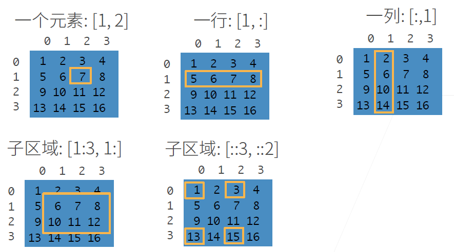
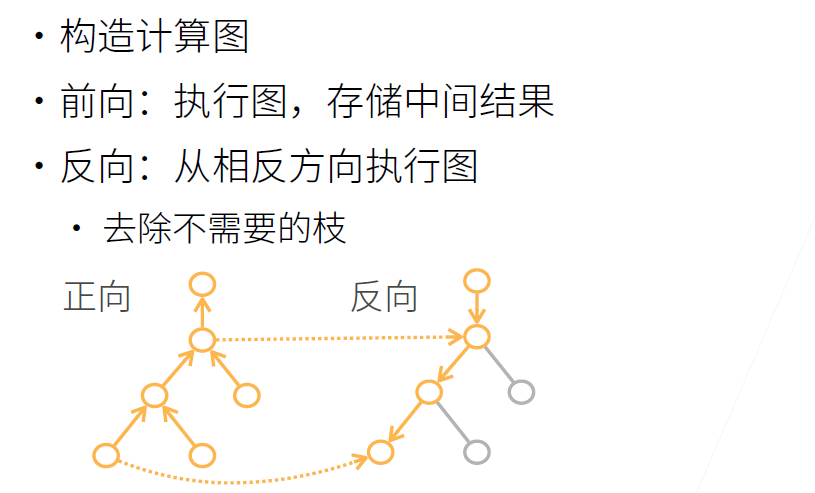

动手学深度学习课程笔记

> contributor: datamonday
>
> github: 

---

> 课程：https://courses.d2l.ai/zh-v2/ 
>
> 教材：https://zh-v2.d2l.ai/
>
> slides：https://github.com/d2l-ai/d2l-zh-pytorch-slides
>
> 直播：[动手学深度学习在线课程](https://app6ca5octe2206.pc.xiaoe-tech.com/live_pc/l_601cc496e4b05a9e88714463)

---

# 0. 前言

>  video : [02 深度学习介绍](https://www.bilibili.com/video/BV1J54y187f9?p=1)
>
> video：[03 安装](https://www.bilibili.com/video/BV18p4y1h7Dr)


## 广告点击


## 环境配置

```shell
# 创建虚拟环境
conda create -n pytorch python=3.8
# 激活虚拟环境
conda activate pytorch
# 在jupyter  notebook中使用幻灯片
pip install rise
# 安装 jupyter notebook
conda install jupyter notebook
# 安装 pytorch-gpu
# 访问官网对找个人主机配置选择安装命令：https://pytorch.org/get-started/locally/
conda install pytorch torchvision torchaudio cudatoolkit=11.1 -c pytorch -c conda-forge
# 安装绘图工具
conda install matplotlib
# 安装数据处理包
conda install pandas
# git clone slides
git clone https://github.com/d2l-ai/d2l-zh-pytorch-slides.git
# 更新
git pull
# 安装d2l软件包，它封装了本书中常⽤的函数和类。
# -U：将所有包升级到最新的可⽤版本
pip install -U d2l
# 安装完成后，通过运⾏以下命令打开Jupyter
jupyter notebook
```

---

# 1. 预备知识

## 1.1 数据操作

> video：[04 数据操作 + 数据预处理](https://www.bilibili.com/video/BV1CV411Y7i4?p=2)
>
> book：p32-p41

**张量（tensor）：n维数组**。n维数组是机器学习和深度学习主要的数据结构。

**向量（vector）**：具有⼀个轴的张量。

**矩阵（matrix）**：具有两个轴的张量。

具有两个轴以上的张量没有特殊的数学名称。

DL框架中的张量（tensor）类（在MXNet 中为ndarray，在PyTorch 和TensorFlow中为Tensor）都与Numpy的ndarray 类似，但都⽐Numpy 的ndarray多⼀些重要功能。⾸先，GPU 很好地⽀持加速计算，而**NumPy仅⽀持CPU计算**。其次，**张量类⽀持⾃动微分**。这些功能使得张量类更适合深度学习。

---

### 1）N维数组


---

### 2）Python切片



---

## 1.2 线性代数

> video：[05 线性代数](https://www.bilibili.com/video/BV1eK4y1U7Qy)
>
> book：p42-p54
>
> lecture：part0_5

### 0）基本概念

**标量（scalar）**：仅包含一个数值。

**变量（variables）**：未知的标量值。由普通小写字⺟表示。

**向量（vector）**：由标量值组成的列表。这些标量值称为向量的**元素（elements）**或**分量（components）**。通常将向量记为粗体、小写的符号。

**维度（dimension）**：向量的长度。向量或轴的维度被⽤来表⽰向量或轴的⻓度，即向量或轴的元素数量。然而，张量的维度⽤来表⽰张量具有的轴数。在这个意义上，张量的某个轴的维数就是这个轴的⻓度。

**矩阵（matrix）**：其由m ⾏和n 列的实值标量组成。创建矩阵：

```python
import numpy as np
A = np.arange(20).reshape(5, 4)
A
```

输出：

```python
array([[ 0,  1,  2,  3],
       [ 4,  5,  6,  7],
       [ 8,  9, 10, 11],
       [12, 13, 14, 15],
       [16, 17, 18, 19]])
```

**矩阵的转置（transpose）**：翻转轴，即交换矩阵的行和列。

```python
A.T
```

输出：

```python
array([[ 0,  4,  8, 12, 16],
       [ 1,  5,  9, 13, 17],
       [ 2,  6, 10, 14, 18],
       [ 3,  7, 11, 15, 19]])
```

**张量（tensor）**：就像向量是标量的推⼴，矩阵是向量的推⼴⼀样，可以构建具有更多轴的数据结构。张量提供了描述具有任意数量轴的n维数组的通⽤⽅法。

```python
X = np.arange(24).reshape(2, 3, 4)
X
```

输出：

```python
array([[[ 0,  1,  2,  3],
        [ 4,  5,  6,  7],
        [ 8,  9, 10, 11]],

       [[12, 13, 14, 15],
        [16, 17, 18, 19],
        [20, 21, 22, 23]]])
```


---

### 1）哈德玛积

张量运算的基本性质：

- **任何按元素的⼀元运算都不会改变其操作数的形状**。同样，**给定具有相同形状的任何两个张量，任何按元素⼆元运算的结果都将是相同形状的张量**。例如，将两个相同形状的矩阵相加会在这两个矩阵上执⾏**元素加法**。

```python
A = np.arange(20).reshape(5, 4)
B = A.copy() # 通过分配新内存，将A的⼀个副本分配给B
A, A + B
```

```python
(array([[ 0,  1,  2,  3],
        [ 4,  5,  6,  7],
        [ 8,  9, 10, 11],
        [12, 13, 14, 15],
        [16, 17, 18, 19]]),
 array([[ 0,  2,  4,  6],
        [ 8, 10, 12, 14],
        [16, 18, 20, 22],
        [24, 26, 28, 30],
        [32, 34, 36, 38]]))
```

**哈达玛积（Hadamard product）**：两个矩阵的按元素乘法。

```python
A * B
```

```python
array([[  0,   1,   4,   9],
       [ 16,  25,  36,  49],
       [ 64,  81, 100, 121],
       [144, 169, 196, 225],
       [256, 289, 324, 361]])
```

- 张量乘以或加上⼀个标量不会改变张量的形状，其中张量的每个元素都将与标量相加或相乘。

---

### 2）汇总求和

**汇总**：可以对任意张量进⾏的⼀个有⽤的操作是**计算其元素的和**。

```python
x = np.arange(4)
x, x.sum()
```

```python
(array([0., 1., 2., 3.]), array(6.))
```

默认情况下，调⽤求和函数会将⼀个张量在所有轴上汇总为⼀个标量。我们还可以指定求和汇总张量的轴。为了通过求和所有⾏的元素来汇总⾏维度（轴0），我们可以在调⽤函数时指定`axis=0`。由于输⼊矩阵沿0轴汇总以⽣成输出向量，因此输⼊的轴0的维数在输出形状中丢失。

```python
A, A.shape

"""
(array([[ 0,  1,  2,  3],
        [ 4,  5,  6,  7],
        [ 8,  9, 10, 11],
        [12, 13, 14, 15],
        [16, 17, 18, 19]]),
 (5, 4))
 """
```

```python
A_sum_axis0 = A.sum(axis=0)
A_sum_axis0, A_sum_axis0.shape

"""
(array([40, 45, 50, 55]), (4,))
"""
```

<font color=red>**按行汇总**（`axis=0`） 的结果：”**行丢失，维度只剩下列**“，即将**每一行中对应位置的元素在列方向上相加**。与直觉上的行列相反！！！实际上的功能是将指定的轴去掉。</font>

指定 axis=1 将通过汇总所有列的元素来汇总列维度（轴1）。因此，输⼊的轴1的维数在输出形状中丢失。

```python
A_sum_axis1 = A.sum(axis=1)
A_sum_axis1, A_sum_axis1.shape

"""
(array([ 6, 22, 38, 54, 70]), (5,))
"""
```

沿着⾏和列对矩阵求和，等价于对矩阵的所有元素进⾏求和。

```python
A.sum(axis=[0, 1]) # Same as `A.sum()`

"""
array(190.)
"""
```

接下来看一下多维的情况：

```python
C = np.ones((2, 5, 4))
C.sum(axis=(0, 2)).shape

"""
(5,)
"""
```

可以看到，去掉了第一个和第三个维度，只剩了第二个维度。

---
### 3）求平均值

通过将总和除以元素总数来计算平均值。

```python
A.mean(), A.sum() / A.size

"""
(array(9.5), array(9.5))
"""
```

同样，计算平均值的函数也可以沿指定轴汇总张量。

```python
A.mean(axis=0), A.sum(axis=0) / A.shape[0]

"""
(array([ 8., 9., 10., 11.]), array([ 8., 9., 10., 11.]))
"""
```

```python
A.mean(axis=1), A.sum(axis=1) / A.shape[1]

"""
(array([ 1.5,  5.5,  9.5, 13.5, 17.5]), array([ 1.5,  5.5,  9.5, 13.5, 17.5]))

"""
```

---
### 3）广播机制

但是，有时在调⽤函数来计算总和或均值时**保持轴数不变**会很有⽤。


```python
sum_A = A.sum(axis=0, keepdims=True)
sum_A, sum_A.shape

"""
(array([[40, 45, 50, 55]]), (1, 4))
"""
```

```python
sum_A = A.sum(axis=1, keepdims=True)
sum_A, sum_A.shape

"""
(array([[ 6],
        [22],
        [38],
        [54],
        [70]]),
 (5, 1))
"""
```

接下来，看一下多维的情况：

```python
C = np.ones((2, 5, 4))
C.sum(axis=(0, 2), keepdims=True).shape

"""
(1, 5, 1)
"""
```

可以看到第一维和第三维的维度得到了保留，即数组仍未三维数组。

由于sum_A 在对每⾏进⾏求和后仍保持两个轴，我们可以通过⼴播将A 除以sum_A 。

```python
A / sum_A

"""
array([[0.        , 0.16666667, 0.33333333, 0.5       ],
       [0.18181818, 0.22727273, 0.27272727, 0.31818182],
       [0.21052632, 0.23684211, 0.26315789, 0.28947368],
       [0.22222222, 0.24074074, 0.25925926, 0.27777778],
       [0.22857143, 0.24285714, 0.25714286, 0.27142857]])
"""
```

---

### 4）求累积和

如果想**沿某个轴计算 A 元素的累积总和**，⽐如axis=0（按⾏计算），可以调⽤ `cumsum` 函数。此函数不会沿任何轴汇总输⼊张量。

```python
A, A.cumsum(0)
```

输出：

```python
(array([[ 0,  1,  2,  3],
        [ 4,  5,  6,  7],
        [ 8,  9, 10, 11],
        [12, 13, 14, 15],
        [16, 17, 18, 19]]),
 array([[ 0,  1,  2,  3],
        [ 4,  6,  8, 10],
        [12, 15, 18, 21],
        [24, 28, 32, 36],
        [40, 45, 50, 55]], dtype=int32))
```

计算过程如下：


---

### 5）点积运算

**点积（Dot Product）**：是两个向量相同位置的按元素乘积的和。

点积在很多场合都很有⽤。例如，给定⼀组由向量x和权重w的加权和可以表示为点积 $x^Tw$。当权重为⾮负数且和为1时，点积表⽰加权平均（weighted average）。将两个向量归⼀化得到单位⻓度后，点积表⽰它们夹⻆的余弦。

```python
x = np.array([1, 2, 3, 4], dtype=np.float32)
y = np.ones(4)
x, y, np.dot(x, y)

"""
(array([1., 2., 3., 4.], dtype=float32), array([1., 1., 1., 1.]), 10.0)
"""
```

### 6）矩阵-向量积

矩阵-向量积（matrix-vector products）。


现在我们知道如何计算点积，我们可以开始理解 矩阵-向量积（matrix-vector products）。回顾矩阵 $\mathbf{A} \in \mathbb{R}^{m \times n}$ 和向量 $\mathbf{x} \in \mathbb{R}^n$。让我们将矩阵$\mathbf{A}$用它的行向量表示


其中每个$\mathbf{a}^\top_{i} \in \mathbb{R}^n$ 都是行向量，表示矩阵的第 $i$ 行。[**矩阵向量积 $\mathbf{A}\mathbf{x}$ 是一个长度为 $m$ 的列向量，其第 $i$ 个元素是点积 $\mathbf{a}^\top_i \mathbf{x}$**]：


**我们可以把一个矩阵 $\mathbf{A}\in \mathbb{R}^{m \times n}$ 乘法看作是一个从 $\mathbb{R}^{n}$ 到 $\mathbb{R}^{m}$ 向量的转换**。这些转换证明是非常有用的。例如，**可以用方阵的乘法来表示旋转**。 也**可以使用矩阵-向量积来描述在给定前一层的值时，求解神经网络每一层所需的复杂计算**。

在代码中使用张量表示矩阵-向量积，我们使用与点积相同的 `dot` 函数。当我们为矩阵 `A` 和向量 `x` 调用 `np.dot(A, x)`时，会执行矩阵-向量积。注意，`A` 的列维数（沿轴1的长度）必须与 `x` 的维数（其长度）相同。

```python
A.shape, x.shape, np.dot(A, x)
```

```python
((5, 4), (4,), array([ 14., 38., 62., 86., 110.]))
```

---

### 7）矩阵-矩阵乘法

矩阵-矩阵乘法（matrix-matrix multiplication）。

假设我们有两个矩阵 $\mathbf{A} \in \mathbb{R}^{n \times k}$ 和 $\mathbf{B} \in \mathbb{R}^{k \times m}$：


用行向量$\mathbf{a}^\top_{i} \in \mathbb{R}^k$ 表示矩阵$\mathbf{A}$的第 $i$ 行，并让列向量$\mathbf{b}_{j} \in \mathbb{R}^k$ 作为矩阵$\mathbf{B}$的第 $j$ 列。要生成矩阵积 $\mathbf{C} = \mathbf{A}\mathbf{B}$，最简单的方法是考虑**$\mathbf{A}$的行向量和$\mathbf{B}$的列向量**:


当我们简单地将每个元素$c_{ij}$计算为点积$\mathbf{a}^\top_i \mathbf{b}_j$:


**我们可以将矩阵-矩阵乘法 $\mathbf{AB}$ 看作是简单地执行 $m$次矩阵-向量积，并将结果拼接在一起，形成一个 $n \times m$ 矩阵**。下面的代码在 `A` 和 `B` 上执行矩阵乘法。这里的`A` 是一个5行4列的矩阵，`B`是一个4行3列的矩阵。相乘后，得到了一个5行3列的矩阵。

```python
B = np.ones(shape=(4, 3))
np.dot(A, B)
```

```python
array([[ 6.,  6.,  6.],
       [22., 22., 22.],
       [38., 38., 38.],
       [54., 54., 54.],
       [70., 70., 70.]])
```

矩阵矩阵乘法可以简单地称为矩阵乘法，不应与哈达玛积混淆。

### 8）范数

线性代数中最有用的一些运算符是 ***范数*（norms）**。非正式地说，一个向量的*范数* 告诉我们**一个向量有多大**。 这里考虑的 ***大小*（size）** 概念不涉及维度，而是**分量的大小**。

在线性代数中，**向量范数是将向量映射到标量的函数** $f$。向量范数要满足一些属性。 给定任意向量 $\mathbf{x}$，第一个性质说，如果按常数因子 $\alpha$ 缩放向量的所有元素，其范数也会按相同常数因子的 *绝对值*  缩放：

$$f(\alpha \mathbf{x}) = |\alpha| f(\mathbf{x}).$$

第二个性质是三角不等式:

$$f(\mathbf{x} + \mathbf{y}) \leq f(\mathbf{x}) + f(\mathbf{y}).$$

第三个性质说范数必须是非负的:

$$f(\mathbf{x}) \geq 0.$$

这是有道理的，因为在大多数情况下，任何东西的最小的*大小*是0。最后一个性质要求范数最小为0，当且仅当向量全由0组成。

$$\forall i, [\mathbf{x}]_i = 0 \Leftrightarrow f(\mathbf{x})=0.$$

你可能会注意到，范数听起来很像距离的度量。事实上，**欧几里得距离是一个 $L_2$ 范数**。假设$n$维向量 $\mathbf{x}$ 中的元素是$x_1, \ldots, x_n$，其 **$L_2$ 范数 是向量元素平方和的平方根**：

**$$||\mathbf{x}||_2 = \sqrt{\sum_{i=1}^n x_i^2},$$**

其中，在 $L_2$ 范数中常常省略下标 $2$，也就是说，$||\mathbf{x}||$ 等同于 $||\mathbf{x}||_2$。在代码中，我们可以按如下方式计算向量的 $L_2$ 范数。

```python
u = np.array([3, -4])
np.linalg.norm(u)

"""
array(5.)
"""
```

在深度学习中，我们更经常地使用 $L_2$ 范数的平方。你还会经常遇到 **$L_1$ 范数，它表示为向量元素的绝对值之和**：

**$$||\mathbf{x}||_1 = \sum_{i=1}^n |x_i|.$$**

与 $L_2$ 范数相比，$L_1$ 范数受异常值的影响较小。为了计算 $L_1$ 范数，我们将绝对值函数和按元素求和组合起来。

```python
np.abs(u).sum()

"""
array(7.)
"""
```

$L_2$ 范数和 $L_1$ 范数都是更一般的$L_p$范数的特例：

$$||\mathbf{x}||_p = \left(\sum_{i=1}^n \left|x_i \right|^p \right)^{1/p}$$

类似于向量的$L_2$ 范数，**矩阵** $\mathbf{X} \in \mathbb{R}^{m \times n}$ **的 弗罗贝尼乌斯范数（Frobenius norm） 是矩阵元素平方和的平方根：**

(**$$||\mathbf{X}||_F = \sqrt{\sum_{i=1}^m \sum_{j=1}^n x_{ij}^2}$$**

弗罗贝尼乌斯范数满足向量范数的所有性质。它就像是矩阵形向量的 $L_2$ 范数。调用以下函数将计算矩阵的弗罗贝尼乌斯范数。

```python
np.linalg.norm(np.ones((4, 9)))

"""
array(6.)
"""
```

---

**范数和目标**

在深度学习中，我们经常试图解决优化问题： *最大化* 分配给观测数据的概率；*最小化* 预测和真实观测之间的距离。用向量表示物品(如单词、产品或新闻文章)，以便最小化相似项目之间的距离，最大化不同项目之间的距离。 通常，目标，或许是深度学习算法最重要的组成部分(除了数据)，被表达为范数。

---

## 1.3 微分

> video：[06 矩阵计算](https://www.bilibili.com/video/BV1eZ4y1w7PY/?spm_id_from=autoNext)
>
> book：p55-p60
>
> lecture：part0_6

在2500年前，古希腊人把一个多边形分成三角形，并把它们的面积相加，才找到计算多边形面积的方法。 为了求出曲线形状（比如圆）的面积，古希腊人在这样的形状上刻内接多边形。内接多边形的等长边越多，就越接近圆。这个过程也被称为 **逼近法（method of exhaustion）**。

[ 

事实上，逼近法就是 **积分（integral calculus）** 的起源，2000 多年后，微积分的另一支，**微分（differential calculus）**，被发明出来。在微分学最重要的应用是优化问题，即考虑如何把事情做到最好。

在深度学习中，训练模型，不断更新它们，使它们在看到越来越多的数据时变得越来越好。通常情况下，变得更好意味着最小化一个 **损失函数（loss function）**，即一个**衡量“模型有多糟糕”这个问题的分数**。这个问题比看上去要微妙得多。最终，我们真正关心的是生成一个能够在从未见过的数据上表现良好的模型。但我们只能将模型与我们实际能看到的数据相拟合。因此，我们可以将拟合模型的任务分解为两个关键问题：（1）**优化（optimization）**：用模型拟合观测数据的过程；（2）**泛化（generalization）**：数学原理和实践者的智慧，能够指导我们生成出有效性超出用于训练的数据集本身的模型。

---

### 1）导数和微分

我们首先讨论导数的计算，这是几乎所有深度学习优化算法的关键步骤。在深度学习中，我们通常选择对于模型参数可微的损失函数。简而言之，这意味着，对于每个参数， 如果我们把这个参数*增加*或*减少*一个无穷小的量，我们可以知道损失会以多快的速度增加或减少，

假设我们有一个函数 $f: \mathbb{R} \rightarrow \mathbb{R}$，其输入和输出都是标量。(**$f$ 的 \*导数\* 被定义为**)

**$$f'(x) = \lim_{h \rightarrow 0} \frac{f(x+h) - f(x)}{h}$$**

如果这个极限存在。如果$f'(a)$存在，则称$f$在$a$处是 **可微（differentiable）**的。如果 $f$ 在一个区间内的每个数上都是可微的，则此函数在此区间中是可微的。我们可以将上式中的导数 $f'(x)$ 解释为$f(x)$相对于 $x$ 的 **瞬时（instantaneous） 变化率**。所谓的瞬时变化率是基于$x$中的变化$h$，且$h$接近$0$。

让我们熟悉一下导数的几个等价符号。 给定 $y = f(x)$，其中 $x$ 和 $y$ 分别是函数 $f$ 的自变量和因变量。以下表达式是等价的：

$$f'(x) = y' = \frac{dy}{dx} = \frac{df}{dx} = \frac{d}{dx} f(x) = Df(x) = D_x f(x),$$

其中**符号 $\frac{d}{dx}$ 和 $D$ 是*微分运算符*，表示*微分*操作**。我们可以使用以下规则来对常见函数求微分：

- $DC = 0$ （$C$ 是一个常数）
- $Dx^n = nx^{n-1}$ （*幂律*（power rule）, $n$是任意实数）
- $De^x = e^x$
- $D\ln(x) = 1/x$

为了微分一个由一些简单函数（如上面的常见函数）组成的函数，下面的法则使用起来很方便。 假设函数$f$和$g$都是可微的，$C$是一个常数，我们有：

*常数相乘法则* $$\frac{d}{dx} [Cf(x)] = C \frac{d}{dx} f(x),$$

*加法法则*

$$\frac{d}{dx} [f(x) + g(x)] = \frac{d}{dx} f(x) + \frac{d}{dx} g(x),$$

*乘法法则*

$$\frac{d}{dx} [f(x)g(x)] = f(x) \frac{d}{dx} [g(x)] + g(x) \frac{d}{dx} [f(x)],$$

*除法法则*

$$\frac{d}{dx} \left[\frac{f(x)}{g(x)}\right] = \frac{g(x) \frac{d}{dx} [f(x)] - f(x) \frac{d}{dx} [g(x)]}{[g(x)]^2}.$$

现在我们可以应用上述几个法则来计算 $u' = f'(x) = 3 \frac{d}{dx} x^2-4\frac{d}{dx}x = 6x-4$。因此，通过令 $x = 1$ ，我们有 $u' = 2$ 。当 $x=1$ 时，此导数也是曲线 $u = f(x)$ 切线的斜率。

---

### 2）偏导数

到目前为止，我们只讨论了仅含一个变量的函数的微分。在深度学习中，函数通常依赖于许多变量。因此，我们需要将微分的思想推广到这些 *多元函数* （multivariate function）上。

设 $y = f(x_1, x_2, \ldots, x_n)$ 是一个具有 $n$ 个变量的函数。$y$ 关于第$i$ 个参数$x_i$的*偏导数*（partial derivative）为：

$$ \frac{\partial y}{\partial x_i} = \lim_{h \rightarrow 0} \frac{f(x_1, \ldots, x_{i-1}, x_i+h, x_{i+1}, \ldots, x_n) - f(x_1, \ldots, x_i, \ldots, x_n)}{h}.$$

为了计算 $\frac{\partial y}{\partial x_i}$，可以简单地将 $x_1, \ldots, x_{i-1}, x_{i+1}, \ldots, x_n$ 看作常数，并计算 $y$关于$x_i$ 的导数。对于偏导数的表示，以下是等价的：

$$\frac{\partial y}{\partial x_i} = \frac{\partial f}{\partial x_i} = f_{x_i} = f_i = D_i f = D_{x_i} f$$

### 3）梯度

我们可以连结一个多元函数对其所有变量的偏导数，以得到该函数的 **梯度（gradient）向量**。设函数 $f: \mathbb{R}^n \rightarrow \mathbb{R}$ 的输入是一个 $n$ 维向量 $\mathbf{x} = [x_1, x_2, \ldots, x_n]^\top$，并且输出是一个标量。 函数 $f(\mathbf{x})$ 相对于 $\mathbf{x}$ 的梯度是一个包含$n$个偏导数的向量：

$$\nabla_{\mathbf{x}} f(\mathbf{x}) = \bigg[\frac{\partial f(\mathbf{x})}{\partial x_1}, \frac{\partial f(\mathbf{x})}{\partial x_2}, \ldots, \frac{\partial f(\mathbf{x})}{\partial x_n}\bigg]^\top,$$

其中 $\nabla_{\mathbf{x}} f(\mathbf{x})$ 通常在没有歧义时被 $\nabla f(\mathbf{x})$ 取代。

**假设$\mathbf{x}$为$n$维向量，在微分多元函数时经常使用以下规则**:

- 对于所有$\mathbf{A} \in \mathbb{R}^{m \times n}$，都有 $\nabla_{\mathbf{x}} \mathbf{A} \mathbf{x} = \mathbf{A}^\top$
- 对于所有$\mathbf{A} \in \mathbb{R}^{n \times m}$，都有 $\nabla_{\mathbf{x}} \mathbf{x}^\top \mathbf{A} = \mathbf{A}$
- 对于所有$\mathbf{A} \in \mathbb{R}^{n \times n}$，都有 $\nabla_{\mathbf{x}} \mathbf{x}^\top \mathbf{A} \mathbf{x} = (\mathbf{A} + \mathbf{A}^\top)\mathbf{x}$
- $\nabla_{\mathbf{x}} |\mathbf{x} |^2 = \nabla_{\mathbf{x}} \mathbf{x}^\top \mathbf{x} = 2\mathbf{x}$

对于任何矩阵 $\mathbf{X}$，都有 $\nabla_{\mathbf{X}} |\mathbf{X} |_F^2 = 2\mathbf{X}$。梯度对于设计深度学习中的优化算法有很大用处。

---

### 4）向量求导

将导数拓展到向量：


---


---


---


---

### 5）矩阵求导


---

### 6）链式法则

然而，上面方法可能很难找到梯度。 这是因为在深度学习中，多元函数通常是 **复合（composite）** 的，所以我们可能没法应用上述任何规则来微分这些函数。 幸运的是，链式法则使我们能够微分复合函数。

让我们先考虑单变量函数。假设函数 $y=f(u)$ 和 $u=g(x)$ 都是可微的，根据链式法则：

$$\frac{dy}{dx} = \frac{dy}{du} \frac{du}{dx}.$$

现在让我们把注意力转向一个更一般的场景，即函数具有任意数量的变量的情况。假设可微分函数 $y$ 有变量 $u_1, u_2, \ldots, u_m$，其中每个可微分函数 $u_i$ 都有变量 $x_1, x_2, \ldots, x_n$。注意，$y$是 $x_1, x_2， \ldots, x_n$ 的函数。对于任意 $i = 1, 2, \ldots, n$，链式法则给出：

$$\frac{dy}{dx_i} = \frac{dy}{du_1} \frac{du_1}{dx_i} + \frac{dy}{du_2} \frac{du_2}{dx_i} + \cdots + \frac{dy}{du_m} \frac{du_m}{dx_i}$$

---

拓展到向量：


例1：


例2：


注意：单位矩阵 $I$ 为维度相同的向量对向量的求导结果。

---

### 小结

- 微分和积分是微积分的两个分支，其中前者可以应用于深度学习中无处不在的优化问题。
- 导数可以被解释为函数相对于其变量的瞬时变化率。它也是函数曲线的切线的斜率。
- 梯度是一个向量，其分量是多变量函数相对于其所有变量的偏导数。
- 链式法则使我们能够微分复合函数。

---

## 1.4 自动求导

> video：[07 自动求导](https://www.bilibili.com/video/BV1KA411N7Px/?spm_id_from=autoNext)
>
> book：p61-p65
>
> lecture：part0_7

深度学习框架通过自动计算导数，即 **自动求导（automatic differentiation）**，来加快这项工作。实际中，根据我们设计的模型，系统会构建一个 **计算图 （computational graph）**，来跟踪计算是哪些数据通过哪些操作组合起来产生输出。自动求导使系统能够随后反向传播梯度。 这里，**反向传播（backpropagate）**只是意味着跟踪整个计算图，填充关于每个参数的偏导数。


---

### 1）计算图


### 2）反向传播





---

### 3）标量的梯度计算

**假设我们想对函数 $y = 2\mathbf{x}^{\top}\mathbf{x}$关于列向量 $\mathbf{x}$求导**。首先，创建变量 `x` 并为其分配一个初始值。

```python
import torch

x = torch.arange(4.0)
x

"""
tensor([0., 1., 2., 3.])
"""
```

**在计算$y$关于$\mathbf{x}$的梯度之前，需要一个地方来存储梯度**。不会在每次对一个参数求导时都分配新的内存。因为经常会成千上万次地更新相同的参数，每次都分配新的内存可能很快就会将内存耗尽。注意，**标量函数关于向量$\mathbf{x}$的梯度是向量，并且与$\mathbf{x}$具有相同的形状**。

```python
x.requires_grad_(True)
x.grad
```

等价于

```python
x = torch.arange(4.0, requires_grad=True)
x

"""
tensor([0., 1., 2., 3.], requires_grad=True)
"""
```

**现在计算 $y$**

```python
# 此处，y是标量
y = 2 * torch.dot(x, x)
y

"""
tensor(28., grad_fn=<MulBackward0>)
"""
```

通过调用反向传播函数来自动计算`y`关于`x` 每个分量的梯度
- Notice: 标量对向量求导，结果为向量！！！

```python
y.backward()
x.grad

"""
tensor([ 0.,  4.,  8., 12.])
"""
```

函数 $y = 2\mathbf{x}^{\top}\mathbf{x}$ 关于$\mathbf{x}$ 的梯度应为$4\mathbf{x}$。验证梯度是否正确计算：

```python
x.grad == 4 * x

"""
tensor([True, True, True, True])
"""
```

现在让我们计算 `x` 的另一个函数：

- 在默认情况下，PyTorch会累积梯度，我们需要清除之前的值。

- Notice: PyTorch中，带下划线的函数（例如 `zero_()`）表示重写内容

```python
x.grad.zero_()

# x.sum() : tensor(6., grad_fn=<SumBackward0>)
y = x.sum()

y.backward()
x.grad
```

TensorFlow中的梯度计算：

```python
with tf.GradientTape() as t:
    y = tf.reduce_sum(x)
t.gradient(y, x)  # 被新计算的梯度覆盖
```

### 4）非标量变量的反向传播

当 `y` 不是标量时，向量`y`关于向量`x`的导数的最自然解释是一个矩阵。对于高阶和高维的 `y` 和 `x`，求导的结果可以是一个高阶张量。

然而，虽然这些更奇特的对象确实出现在高级机器学习中（包括深度学习中），但当我们调用向量的反向计算时，我们通常会**试图计算一批训练样本中每个组成部分的损失函数的导数**。这里，**我们的目的不是计算微分矩阵，而是批量中每个样本单独计算的偏导数之和**。所以先做一个sum操作，将y转换为标量，之后再求导，得到标量关于向量的导数，结果为向量，而不是矩阵。

```python
# 对非标量调用`backward`需要传入一个`gradient`参数，该参数指定微分函数关于`self`的梯度。在我们的例子中，我们只想求偏导数的和，所以传递一个1的梯度是合适的

x.grad.zero_()

# 此处，y是向量
y = x * x

# 等价于 y.backward(torch.ones(len(x)))
y.sum().backward()

# 向量对向量求导的结果是矩阵
x.grad
```

```python
tensor([0., 2., 4., 6.])
```

### 5）分离计算

有时，我们希望**将某些计算移动到记录的计算图之外**。 例如，假设`y`是作为`x`的函数计算的，而`z`则是作为`y`和`x`的函数计算的。 现在，想象一下，我们想计算 `z` 关于 `x` 的梯度，但由于某种原因，我们希望将 `y` 视为一个常数，并且只考虑到 `x` 在`y`被计算后发挥的作用。

在这里，我们可以**分离 `y` 来返回一个新变量 `u`，该变量与 `y` 具有相同的值，但丢弃计算图中如何计算 `y` 的任何信息**。换句话说，**梯度不会向后流经 `u` 到 `x`**。因此，下面的反向传播函数计算 `z = u * x` 关于 `x` 的偏导数，同时将 `u` 作为常数处理，而不是`z = x * x * x`关于 `x` 的偏导数。

`.detach()` 返回一个新的从当前计算图中分离下来的tensor，但是仍指向原变量的存放位置，不同之处只是requires_grad=false，得到的这个tensor永远不需要计算其梯度，不具有grad。即使之后重新将它的requires_grad=true，它也不会具有梯度grad。这个新的tensor进行反向传播时，调用detach()的tensor就会停止，不能再继续向前进行传播。

注意：使用detach返回的tensor和原始的tensor共同一个内存，即一个修改另一个也会跟着改变。

```python
x.grad.zero_()
y = x * x

u = y.detach()
z = u * x

z.sum().backward()
x.grad == u
```

```python
tensor([True, True, True, True])
```

由于记录了 `y` 的计算结果，可以随后在 `y` 上调用反向传播，得到 `y = x * x` 关于的`x`的导数，这里是 `2 * x`。

```python
x.grad.zero_()

y.sum().backward()

x.grad == 2 * x
```

```python
tensor([True, True, True, True])
```

### 6）Python控制流的梯度计算

使用自动求导的一个好处是，**即使构建函数的计算图需要通过 Python控制流（例如，条件、循环或任意函数调用），我们仍然可以计算得到的变量的梯度**。在下面的代码中，`while` 循环的迭代次数和 `if` 语句的结果都取决于输入 `a` 的值。

```python
def f(a):
    b = a * 2
    while b.norm() < 1000:
        b = b * 2
    if b.sum() > 0:
        c = b
    else:
        c = 100 * b
    return c
```

计算梯度：

```python
# 不指定size，则表示标量
a = torch.randn(size=(), requires_grad=True)
d = f(a)
d.backward()
```

现在可以分析上面定义的 `f` 函数。请注意，它在其输入 `a` 中是分段线性的。换言之，对于任何 `a`，存在某个常量标量 `k`，使得 `f(a) = k * a`，其中 `k` 的值取决于输入 `a`。因此，`d / a` 允许我们验证梯度是否正确。

```python
a.grad == d / a
```

```python
tensor(True)
```

上述代码中的变量为：

```python
"""
a = tensor(-0.8222, requires_grad=True)
d = tensor(-168394.5312, grad_fn=<MulBackward0>)
grad = tensor(204800.)
d / a = tensor(204800., grad_fn=<DivBackward0>)
"""
```

---

### Q & A

**深度学习框架可以自动计算导数。为了使用它，我们首先将梯度附加到想要对其计算偏导数的变量上。然后我们记录目标值的计算，执行它的反向传播函数，并访问得到的梯度**。

1. 为什么深度学习中一般对标量求导而不是矩阵或者向量？

   因为求导是为了反向传播误差，更新权重，而loss往往是一个标量值。

2. 什么时候对向量求导？

   涉及二阶优化算法时需要对向量求导，但计算速度慢。

---

## 1.5 概率论

在某种形式上，机器学习就是做出预测。

根据病人的临床病史，我们可能想预测他们在下一年心脏病发作的概率。在异常检测中，我们可能想要评估飞机喷气发动机的一组读数是正常运行情况的可能性有多大。在强化学习中，我们希望智能体（agent）能在一个环境中智能地行动。这意味着我们需要考虑在每种可行的行为下获得高奖励的概率。当我们建立推荐系统时，我们也需要考虑概率。例如，假设我们为一家大型在线书店工作。我们可能希望估计特定用户购买特定图书的概率。为此，我们需要使用概率学。

### 1）基本概率论

假设掷骰子想知道看到1的几率有多大。如果骰子是公平的，那么所有六个结果${1, \ldots, 6}$都有相同的可能发生，并且概率都为$\frac{1}{6}$。

对于我们从工厂收到的真实骰子，我们可能不知道那些比例，我们需要检查它是否有瑕疵。调查骰子的唯一方法是多次投掷并记录结果。对于每个骰子，我们将观察到 ${1, \ldots, 6}$ 中的一个值。给定这些结果，我们想调查每个结果的概率。

对于每个值，一种自然的方法是将它出现的次数除以投掷的总次数。这给了我们一个给定事件的概率的估计值。**大数定律（law of large numbers）**告诉我们，**随着投掷次数的增加，这个估计值会越来越接近真实的潜在概率**。

首先，导入必要的软件包。

```python
import torch
import random
import numpy as np

from torch.distributions import multinomial
```

在统计学中，我们把从概率分布中抽取样本的过程称为**抽样（sampling）**。将概率分配给⼀些离散选择的分布称为**多项分布（multinomial distribution）**。稍后我们将给出分布（distribution）的更正式定义。但笼统来说，可以把它看作是对事件的概率分配。

**为了抽取⼀个样本，我们只需传⼊⼀个概率向量**。输出是另⼀个相同⻓度的向量：**它在索引$i$处的值是采样结果中$i$出现的次数**。

```python
fair_probs = [1.0/6] * 6
np.random.multinomial(1, fair_probs)
```

```python
array([1, 0, 0, 0, 0, 0])
```

多次运⾏采样器，每次都得到随机的值。在估计⼀个骰⼦的公平性时，我们经常希望从同⼀分布中⽣成多个样本。numpy函数⽀持同时抽取多个样本，返回任意形状的独⽴样本数组。

```python
np.random.multinomial(10, fair_probs)
```

```python
array([1, 2, 2, 2, 0, 3])
```

现在我们知道如何对骰子进行采样，可以模拟1000次投掷。然后，统计1000次投掷后, 每个数字被投中了多少次。具体来说，我们**计算相对频率作为真实概率的估计**。

```python
counts = np.random.multinomial(1000, fair_probs).astype(np.float32)
counts / 1000
```

```python
array([0.172, 0.157, 0.199, 0.154, 0.159, 0.159], dtype=float32)
```

因为我们是从一个公平的骰子中生成的数据，我们知道每个结果都有真实的概率$\frac{1}{6}$，大约是$0.167$，所以上面输出的估计值看起来不错。

我们也可以看到这些概率如何随着时间的推移收敛到真实概率。让我们进行500组实验，每组抽取10个样本。

```python
import matplotlib.pyplot as plt

counts = np.random.multinomial(10, fair_probs, size=500)
cum_counts = counts.astype(np.float32).cumsum(axis=0)
estimates = cum_counts / cum_counts.sum(axis=1, keepdims=True)

plt.figure(figsize=(6, 4.5), dpi=300)
for i in range(6):
    plt.plot(estimates[:, i],
             label=("P(die=" + str(i + 1) + ")"))
    
plt.axhline(y=0.167, color='black', linestyle='dashed')
plt.gca().set_xlabel('Groups of experiments')
plt.gca().set_ylabel('Estimated probability')
plt.legend();
```


#### 概率论公理

在处理骰子掷出时，我们将集合 $\mathcal{S} = \{1, 2, 3, 4, 5, 6\}$ 称为 **样本空间（sample space）** 或 **结果空间（outcome space）**，其中每个元素都是 结果（outcome）。**事件（event）** 是来自给定样本空间的一组结果。

形式上，**概率（probability）** 可以被认为是将集合映射到真实值的函数。在给定的样本空间 $\mathcal{S}$ 中，事件$\mathcal{A}$的概率表示为 $P(\mathcal{A})$，满足以下属性：

- 对于任意事件 $\mathcal{A}$，其概率从不会是负数，即 $P(\mathcal{A}) \geq 0$；
- 整个样本空间的概率为 $1$，即 $P(\mathcal{S}) = 1$；
- **互斥（mutually exclusive）**：（对于所有 $i \neq j$ 都有 $\mathcal{A}_i \cap \mathcal{A}_j = \emptyset$）事件的任意一个可数序列 $\mathcal{A}_1, \mathcal{A}*2, \ldots$ ，序列中任意一个事件发生的概率等于它们各自发生的概率之和，即 $P(\bigcup*{i=1}^{\infty} \mathcal{A}*i) = \sum*{i=1}^{\infty} P(\mathcal{A}_i)$。

这些也是概率论的公理，由科尔莫戈罗夫于 1933 年提出。

#### 随机变量

随机变量（random variable）几乎可以是任何数量，并且不是确定性的。它可以在随机实验的一组可能性中取一个值。考虑一个随机变量 $X$，其值在掷骰子的样本空间 $\mathcal{S} = \{1, 2, 3, 4, 5, 6\}$ 中。$P(X)$ 表示为随机变量 $X$ 上的 **分布（distribution）**：分布告诉我们 **$X$ 获得任意值的概率**。另一方面，我们可以简单用 $P(a)$ 表示随机变量取值 $a$ 的概率。

请注意，离散 (discrete) 随机变量（如骰子的侧面）和 连续 (continuous) 变量（如人的体重和身高）之间存在微妙的区别。

### 2）处理多个随机变量

很多时候，我们会希望一次考虑多个随机变量。比如，我们可能需要对疾病和症状之间的关系进行建模。给定一个疾病和一个症状，比如 “流感” 和 “咳嗽”，以某个概率存在或不存在于某个患者身上。虽然我们可能希望这两者发生的概率都接近于零，但我们可能需要估计这些概率以及概率之间的关系，以便我们可以运用我们的推断来实现更好的医疗服务。

再举一个更复杂的例子：图像包含数百万像素，因此有数百万个随机变量。在许多情况下，图像会附带一个标签，标识图像中的对象。我们也可以将标签视为一个随机变量。我们甚至可以将所有元数据视为随机变量，例如位置、时间、光圈、焦距、ISO、对焦距离和相机类型。所有这些都是联合发生的随机变量。当我们处理多个随机变量时，会有若干个变量是我们感兴趣的。

#### 联合概率

**联合概率(joint probability)** $P(A = a, B=b)$：给定任何值 $a$ 和 $b$，联合概率可以回答，$A=a$ 和 $B=b$ 同时满足的概率是多少。请注意，对于任何 $a$ 和 $b$ 的取值，$P(A = a, B=b) \leq P(A=a)$，即$A=a$ 和 $B=b$ 同时发生的可能性不大于 $A=a$ 或是 $B=b$ 单独发生的可能性。

#### 条件概率

**条件概率 (conditional probability)**：$0 \leq \frac{P(A=a, B=b)}{P(A=a)} \leq 1$。并用 $P(B=b \mid A=a)$ 表示它：在 $A=a$ 已发生的前提下， $B=b$ 发生的概率。

#### 贝叶斯定理

使用条件概率的定义，我们可以得出统计学中最有用和最著名的方程之一：**Bayes 定理 (Bayes' theorem)**。它如下所示。通过构造，有乘法规则， $P(A, B) = P(B \mid A) P(A)$。根据对称性，这也适用于 $P(A, B) = P(A \mid B) P(B)$。假设 $P(B)>0$， 求解其中一个条件变量，得到

$$P(A \mid B) = \frac{P(B \mid A) P(A)}{P(B)}.$$

其中， $P(A, B)$ 是一个 联合分布，$P(A \mid B)$ 是一个 条件分布。这种分布可以在给定值 $A = a, B=b$ 上进行求值。

#### 边际化

如果我们想从另一件事中推断一件事，但我们只知道相反方向的属性，比如因和果的时候，Bayes 定理是非常有用的。为了能进行这项工作，我们需要的一个重要操作是 **边际化**，即**从 $P(A, B)$ 中确定 $P(B)$** 的操作。$B$ 的概率相当于计算 $A$ 的所有可能选择，并将所有选择的联合概率聚合在一起：

$$P(B) = \sum_{A} P(A, B),$$

这也称为 求和规则。边际化结果的概率或分布称为 边际概率 或 边际分布。

#### 独立性

另一个要检查的有用属性是 依赖 与 独立。两个随机变量 $A$ 和 $B$ 是独立的，意味着事件 $A$ 的发生不会透露有关 $B$ 事件的发生情况的任何信息。在这种情况下，统计学家通常将这一点表述为 $A \perp B$。根据贝叶斯定理，马上就能同样得到 $P(A \mid B) = P(A)$。在所有其他情况下，我们称 $A$ 和 $B$ 依赖。

由于 $P(A \mid B) = \frac{P(A, B)}{P(B)} = P(A)$ 等价于 $P(A, B) = P(A)P(B)$，因此两个随机变量是独立的当且仅当两个随机变量的联合分布是其各自分布的乘积。同样地，给定另一个随机变量 $C$ 时，两个随机变量 $A$ 和 $B$ 是 条件独立的，当且仅当 $P(A, B \mid C) = P(A \mid C)P(B \mid C)$ 。这个情况表示为 $A \perp B \mid C$。

### 3）应用

假设一个医生对患者进行艾滋病病毒（HIV）测试。这个测试是相当准确的，如果患者健康但测试显示他患病，这样的失败概率只有 1% 。此外，如果患者真正感染HIV，它永远可以检测出。使用 $D_1$ 来表示诊断结果（如果阳性，则为 $1$，如果阴性，则为 $0$），$H$ 来表示感染艾滋病病毒的状态（如果阳性，则为 $1$，如果阴性，则为0）。 条件概率为 $P(D_1 \mid H)$。

| 条件概率            | $H=1$ | $H=0$ |
| ------------------- | ----- | ----- |
| $P(D_1 = 1 \mid H)$ | 1     | 0.01  |
| $P(D_1 = 0 \mid H)$ | 0     | 0.99  |

请注意，每列的加和都是 1（但每行的加和不是），因为条件概率需要总和为1，就像概率一样。

计算如果测试出来呈阳性，患者感染HIV的概率，即 $P(H = 1 \mid D_1 = 1)$。显然，这将取决于疾病有多常见，因为它会影响错误警报的数量。假设人口总体是相当健康的，例如，$P(H=1) = 0.0015$。为了应用贝叶斯定理，我们需要运用边际化和乘法规则来确定

$$\begin{aligned} &P(D_1 = 1) \ =& P(D_1=1, H=0) + P(D_1=1, H=1) \ =& P(D_1=1 \mid H=0) P(H=0) + P(D_1=1 \mid H=1) P(H=1) \ =& 0.011485. \end{aligned} $$

因此得到

$$\begin{aligned} &P(H = 1 \mid D_1 = 1)\ =& \frac{P(D_1=1 \mid H=1) P(H=1)}{P(D_1=1)} \ =& 0.1306 \end{aligned}.$$

换句话说，尽管使用了非常准确的测试，患者实际上患有艾滋病的几率只有 13.06%。正如我们所看到的，概率可能是违反直觉的。

患者在收到这样可怕的消息后应该怎么办？很可能，患者会要求医生进行另一次测试来了解清楚。第二个测试具有不同的特性，它不如第一个测试那么好。条件概率为 $P(D_2 \mid H)$。

| 条件概率            | $H=1$ | $H=0$ |
| ------------------- | ----- | ----- |
| $P(D_2 = 1 \mid H)$ | 0.98  | 0.03  |
| $P(D_2 = 0 \mid H)$ | 0.02  | 0.97  |

不幸的是，第二次测试也显示阳性。通过假设条件独立性来计算出应用 Bayes 定理的必要概率：

$$\begin{aligned} &P(D_1 = 1, D_2 = 1 \mid H = 0) \ =& P(D_1 = 1 \mid H = 0) P(D_2 = 1 \mid H = 0) \ =& 0.0003, \end{aligned} $$

$$\begin{aligned} &P(D_1 = 1, D_2 = 1 \mid H = 1) \ =& P(D_1 = 1 \mid H = 1) P(D_2 = 1 \mid H = 1) \ =& 0.98. \end{aligned} $$

现在可以应用边际化和乘法规则：

$$\begin{aligned} &P(D_1 = 1, D_2 = 1) \ =& P(D_1 = 1, D_2 = 1, H = 0) + P(D_1 = 1, D_2 = 1, H = 1) \ =& P(D_1 = 1, D_2 = 1 \mid H = 0)P(H=0) + P(D_1 = 1, D_2 = 1 \mid H = 1)P(H=1)\ =& 0.00176955. \end{aligned} $$

最后，鉴于存在两次阳性检测，患者患有艾滋病的概率为

$$\begin{aligned} &P(H = 1 \mid D_1 = 1, D_2 = 1)\ =& \frac{P(D_1 = 1, D_2 = 1 \mid H=1) P(H=1)}{P(D_1 = 1, D_2 = 1)} \ =& 0.8307. \end{aligned} $$

**也就是说，第二次测试使我们能够对患病的情况获得更高的信心**。尽管第二次检验比第一次检验的准确性要低得多，但它仍然显著改善了我们的估计。

### 4）期望和差异

为了概括概率分布的关键特征，我们需要一些测量方法。随机变量 $X$ 的 **期望（或平均值）**表示为

$$E[X] = \sum_{x} x P(X = x).$$

当函数 $f(x)$ 的输入是从分布 $P$ 中抽取的随机变量时，$f(x)$ 的期望值为

$$E_{x \sim P}[f(x)] = \sum_x f(x) P(x).$$

在许多情况下，我们希望**衡量随机变量 $X$ 与其期望值的偏差**。这可以**通过方差来量化**

$$\mathrm{Var}[X] = E\left[(X - E[X])^2\right] = E[X^2] - E[X]^2.$$

它的平方根被称为 **标准差 (standared deviation)**。随机变量函数的方差衡量的是，当从该随机变量分布中采样不同值 $x$ 时，函数值偏离该函数的期望的程度：

$$\mathrm{Var}[f(x)] = E\left[\left(f(x) - E[f(x)]\right)^2\right]$$

### 小结

- 我们可以从概率分布中采样。
- 我们可以使用联合分布、条件分布、Bayes 定理、边缘化和独立性假设来分析多个随机变量。
- 期望和方差为概率分布的关键特征的概括提供了实用的度量形式。

---


```python

```


```python

```

```python

```


---

> video：[]()

